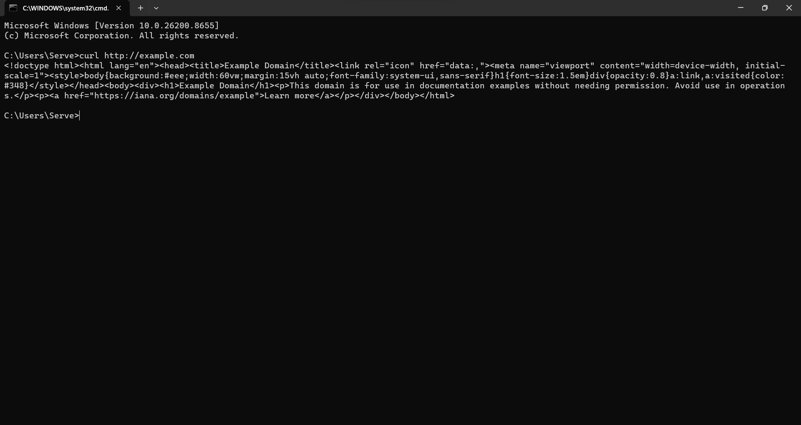
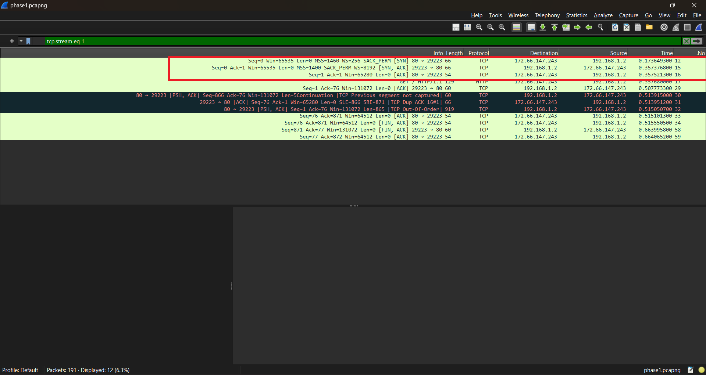
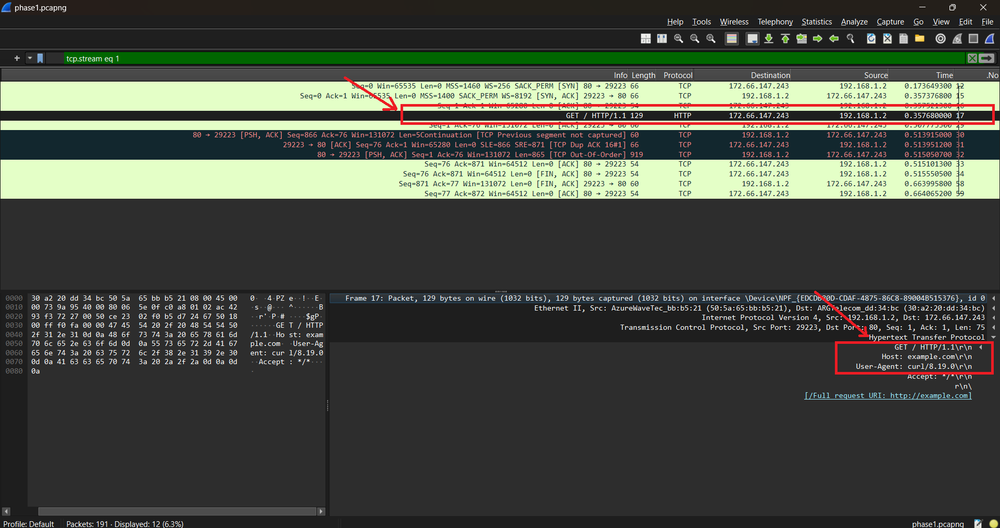
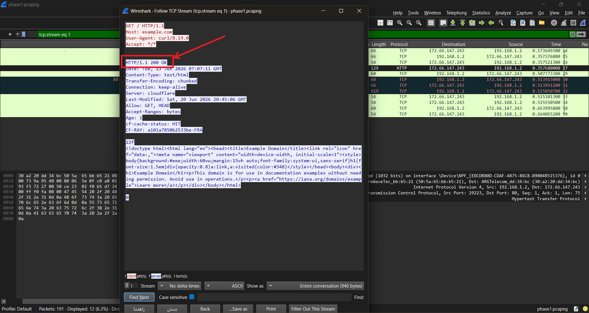
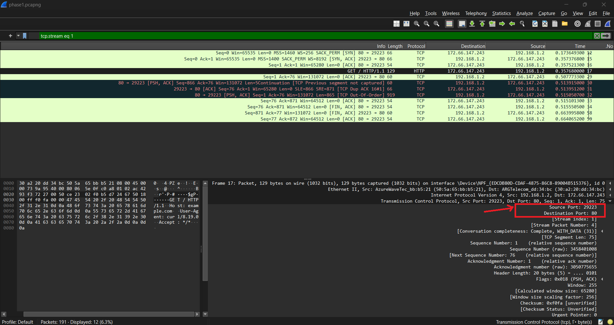
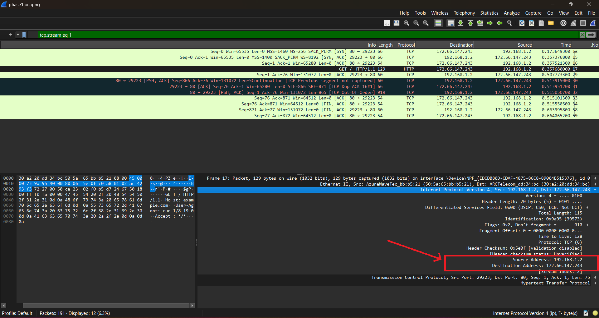
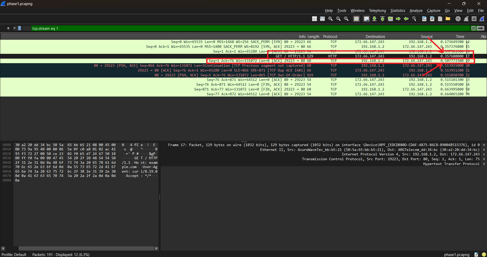
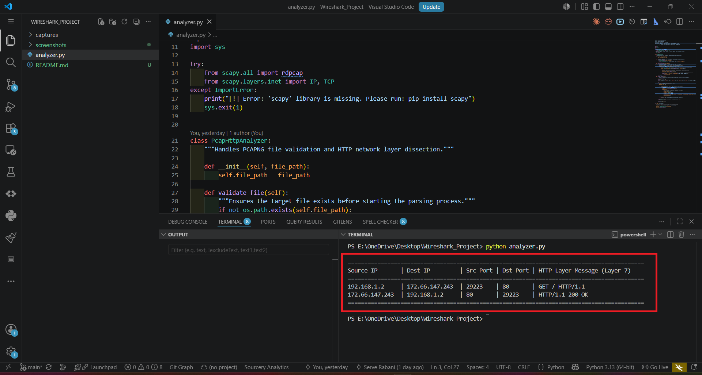

# پروژه شماره ۲ شبکه‌های کامپیوتری

## تحلیل ارتباط HTTP با استفاده از Wireshark

## مشخصات پروژه

| نام و نام خانوادگی | شماره دانشجویی | نقش                                                                            |
| ------------------ | -------------- | ------------------------------------------------------------------------------ |
| سرو ربانی          |40217023134 | انجام تمامی مراحل پروژه، تحلیل ترافیک، مستندسازی و پیاده‌سازی بخش برنامه‌نویسی |

---

## مقدمه

هدف این پروژه بررسی نحوه برقراری یک ارتباط HTTP و تحلیل بسته‌های رد و بدل شده بین کلاینت و سرور با استفاده از Wireshark است. برای تولید ترافیک از ابزار `curl` استفاده شد تا یک درخواست HTTP واقعی به سایت `example.com` ارسال شود. سپس بسته‌های ثبت شده در لایه‌های مختلف شبکه مورد بررسی قرار گرفتند.

---

## 1. تولید و ثبت ترافیک HTTP

در ابتدا Wireshark روی کارت شبکه فعال سیستم اجرا شد و فرآیند Capture آغاز گردید. سپس در محیط PowerShell دستور زیر اجرا شد:

```bash
curl http://example.com
```

با اجرای این دستور یک درخواست HTTP به سرور ارسال شد و بسته‌های مربوط به این ارتباط در Wireshark ثبت شدند. پس از دریافت پاسخ، عملیات Capture متوقف و فایل خروجی ذخیره شد.

<p align="center">
  
</p>

<p align="center">
تصویر ۱ - ایجاد ترافیک HTTP و ثبت آن در Wireshark
</p>

---

## 2. بررسی فرآیند Three-Way Handshake

قبل از انتقال داده‌های HTTP لازم است یک ارتباط TCP بین کلاینت و سرور برقرار شود. این فرآیند با مکانیزم Three-Way Handshake انجام می‌شود.

در بسته‌های ثبت شده سه مرحله اصلی مشاهده شد:

* SYN
* SYN, ACK
* ACK

در مرحله اول کلاینت درخواست برقراری ارتباط را ارسال می‌کند. سرور با ارسال SYN, ACK آمادگی خود را برای ایجاد اتصال اعلام می‌کند و در نهایت کلاینت با ارسال ACK ارتباط را تأیید می‌کند. پس از این مرحله انتقال داده آغاز می‌شود.

<p align="center">
  
</p>

<p align="center">
تصویر ۲ - مراحل برقراری اتصال TCP
</p>

---

## 3. بررسی درخواست HTTP

پس از برقراری اتصال TCP، درخواست HTTP توسط کلاینت ارسال شد.

| فیلد         | مقدار       |
| ------------ | ----------- |
| Method       | GET         |
| HTTP Version | HTTP/1.1    |
| Host         | example.com |
| User-Agent   | curl/8.19.0 |

در این درخواست از متد GET برای دریافت صفحه اصلی سایت استفاده شده است. هدر Host دامنه مقصد را مشخص می‌کند و User-Agent نشان می‌دهد درخواست توسط ابزار curl ارسال شده است.

<p align="center">
  
</p>

<p align="center">
تصویر ۳ - اطلاعات درخواست HTTP
</p>

---

## 4. بررسی پاسخ سرور

برای مشاهده کامل تبادل داده از قابلیت Follow TCP Stream استفاده شد.

| فیلد         | مقدار      |
| ------------ | ---------- |
| Status Code  | 200 OK     |
| Content-Type | text/html  |
| Server       | cloudflare |

کد وضعیت 200 OK نشان می‌دهد که درخواست با موفقیت توسط سرور پردازش شده و پاسخ معتبر برای کلاینت ارسال شده است.

<p align="center">
  
</p>

<p align="center">
تصویر ۴ - پاسخ دریافتی از سرور
</p>

---

## 5. بررسی لایه TCP

در هدر TCP اطلاعات زیر مشاهده شد:

| پارامتر          | مقدار |
| ---------------- | ----- |
| Source Port      | 29223 |
| Destination Port | 80    |
| Protocol         | TCP   |

پورت مقصد 80 پورت استاندارد پروتکل HTTP است و پورت مبدأ به صورت پویا توسط سیستم عامل انتخاب شده است تا این ارتباط از سایر ارتباطات شبکه قابل تشخیص باشد.

<p align="center">
  
</p>

<p align="center">
تصویر ۵ - اطلاعات لایه TCP
</p>

---

## 6. بررسی لایه IP

در بخش IPv4 اطلاعات زیر استخراج شد:

| پارامتر        | مقدار          |
| -------------- | -------------- |
| Source IP      | 192.168.1.2    |
| Destination IP | 172.66.147.243 |

آدرس مبدأ مربوط به سیستم کلاینت در شبکه محلی و آدرس مقصد مربوط به سرور دریافت‌کننده درخواست HTTP است.

<p align="center">
  
</p>

<p align="center">
تصویر ۶ - اطلاعات لایه IP
</p>

---

## 7. محاسبه RTT

برای محاسبه RTT زمان ارسال درخواست HTTP و زمان دریافت اولین پاسخ سرور بررسی شد.

| رویداد            | زمان (ثانیه) |
| ----------------- | ------------ |
| ارسال درخواست GET | 0.357680     |
| دریافت اولین پاسخ | 0.507773     |

بنابراین:

```text
RTT = 0.507773 - 0.357680
RTT ≈ 0.150093 s
RTT ≈ 150 ms
```

این مقدار نشان می‌دهد حدود 150 میلی‌ثانیه طول کشیده تا درخواست به سرور برسد و اولین پاسخ دریافت شود.

<p align="center">
  
</p>

<p align="center">
تصویر ۷ - محاسبه RTT
</p>

---

## 8. عوامل مؤثر بر RTT

عوامل مختلفی می‌توانند باعث افزایش RTT شوند:

* ازدحام شبکه
* فاصله زیاد بین کلاینت و سرور
* از دست رفتن بسته‌ها و ارسال مجدد آن‌ها
* بار پردازشی زیاد روی سرور
* محدودیت پهنای باند

افزایش RTT معمولاً باعث کندتر شدن بارگذاری صفحات وب و افزایش زمان پاسخ سرویس‌ها می‌شود.

---

## 9. بخش تشویقی: تحلیل خودکار فایل Capture با پایتون

برای خودکارسازی بخشی از فرآیند تحلیل، برنامه‌ای به زبان Python و با استفاده از کتابخانه Scapy توسعه داده شد.

این برنامه قادر است:

* فایل pcapng را بخواند.
* آدرس‌های IP را استخراج کند.
* اطلاعات بسته‌های HTTP را نمایش دهد.
* خلاصه‌ای از ارتباط ثبت شده را ارائه کند.

### نحوه اجرا

```bash
pip install scapy

python analyzer.py
```

<p align="center">
  
</p>

<p align="center">
تصویر ۸ - خروجی برنامه تحلیلگر
</p>

---

## ساختار پروژه

```text
.
├── captures/
│   └── phase1.pcapng
├── screenshots/
│   ├── capture.png
│   ├── handshake.png
│   ├── http_request.png
│   ├── http_response.png
│   ├── tcp_details.png
│   ├── ip_details.png
│   ├── rtt.png
│   └── analyzer_output.png
├── analyzer.py
└── README.md
```

---

## نتیجه‌گیری

در این پروژه یک ارتباط HTTP واقعی مورد بررسی قرار گرفت. فرآیند برقراری اتصال TCP، درخواست HTTP، پاسخ سرور، اطلاعات لایه‌های TCP و IP و همچنین زمان RTT تحلیل شدند. نتایج به دست آمده نشان داد که ارتباط به درستی برقرار شده و تبادل داده مطابق ساختار استاندارد پشته TCP/IP انجام شده است.
